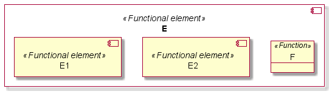

# Functional analysis

Functional analysis is the systematic examination of a defined [function](../../engineering-concepts/definitions.md) to identify all the subfunctions necessary to accomplish that function and to identify the incoming / outgoing [data](../../engineering-concepts/definitions.md) flowing between them (Adapted from [REF\_3](../../engineering-concepts/references.md))

From a methodological point of view, the definition of a function can be justified by:

* The documentation of a requirement specifying its behavior or its quality;
* The refinement of an activity identified during the operational analysis;
* The identification of new data to be created / transformed during the definition of the functional architecture and/or the physical architecture.

## Data creation

### Definition

JARVIS4SE allows to define a new data named _\<data name>_ through the following command:

```
<data name> is a data
```

### Attributes

JARVIS4SE allows to define an attribute named _\<attribute name>_ for a data named _\<data name>_ through the following commands:

```
<attribute name> is an attribute
The <attribute name> of <data name> is <attribute value>
```

The definition of an attribute implies to assign a value _\<attribute value>_ that characterizes the data.

<mark style="color:orange;">Note: the first command is only required when the attribute does not exist.</mark>

## Function creation

### Definition

JARVIS4SE allows to define a new function named _\<function name>_ through the following command:

```
<function name> is a function
```

### Attributes

JARVIS4SE allows to define an attribute named _\<attribute name>_ for a function named _\<function name>_ through the following commands:

```
<attribute name> is an attribute
The <attribute name> of <function name> is <attribute value>
```

The definition of an attribute implies to assign a value _\<attribute value>_ that characterizes the function.

<mark style="color:orange;">Note: the first command is only required when the attribute does not exist.</mark>

### Data consumption

JARVIS4SE allows to indicate that a data named _\<data name>_ is consumed by a function named _\<function name>_ through the following command:

```
<function name> consumes <data name>
```

### Data production

JARVIS4SE allows to indicate that a data named _\<data name>_ is produced by a function named _\<function name>_ through the following command:

```
<function name> produces <data name>
```

### Context visualization

JARVIS4SE allows to visualize the context of a function named _\<function name>_ through the following command:

```
show context <function name>
```

Below an example of a context visualization for a function F defined as followed: y = F(x) with PlantUML:

```
F is a function
x is a data
F consumes x
y is a data
F produces y
show context F
```

.png>)

## Function decomposition

### Child definition

JARVIS4SE allows to decompose a function named _\<function name>_ into subfunctions named _\<subfunction i name>_ through the following command:

```
<function name> is composed of <subfunction 1 name>, <subfunction 2 name>
```

<mark style="color:orange;">Note: the subfunctions must be created before as functions</mark>. Please refer to chapter <mark style="color:orange;"></mark> ["Function creation"](functional-analysis.md#function-creation)

### Decomposition visualization

JARVIS4SE allows to visualize the decomposition of a function named _\<function name>_ through the following command:

```
show decomposition <function name>
```

Below an example of a decomposition of the previous function F (defined as followed: y = F(x)) into F1 (defined as followed:  a = F1(x)) and F2 (defined as followed: y = F2(a)) with PlantUML:

```
F1 is a function
a is a data
F1 consumes x
F1 produces a
F2 is a function
F2 consumes a
F2 produces y
F is composed of F1, F2
```



## Activity allocation

JARVIS4SE allows to allocate an activity named \<activity name> to a function named \<function name> through the following command:

```
<function name> allocates <activity name>
```

## Requirement allocation

JARVIS4SE allows to allocate a requirement named \<requirement name> to a function named \<function name> through the following command:

```
<function name> allocates <requirement name>
```

## Functional chain

### Chain visualization

JARVIS4SE allows to visualize a chain of functions named _\<function i name>,_ linked together by the data they produce/consume, through the following command:

```
show chain <function 1 name>, <function 2 name>
```

<mark style="color:orange;">Note: chain visualization could be equivalent to a decomposition visualization in case of dealing with the chain of all subfunctions of the same function.</mark>

### Sequence visualization

JARVIS4SE allows to visualize a chain of functions named _\<function i name>,_ linked together by the data they produce/consume, as a sequence of functions, through the following command:

```
show sequence <function 1 name>, <function 2 name>
```

Below an example of a sequence visualization with the previous F1 and F2 subfunctions:

```
show sequence F1, F2
```

.png>)
