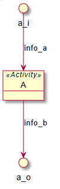

# Functional architecture definition

Functional architecture is the systematic examination of different implementation-independant architecture candidates to identify independent groups of [functions](../engineering-concepts/definitions.md) and their required ressources to be executed (so called [functional elements](../engineering-concepts/definitions.md)) from the [functional analysis](functional-analysis.md), to organize the way they exchange [data](../engineering-concepts/definitions.md) (so called [functional interfaces](../engineering-concepts/definitions.md)), and to select the best one according to the selected architecture criteria (Adapted from [REF\_3](../engineering-concepts/references.md))

## Functional interface creation

### Definition

JARVIS4SE allows to define a new functional interface named _\<functional interface name>_ through the following command:

```
<functional interface name> is a functional interface
```

### Attributes

JARVIS4SE allows to define an attribute named _\<attribute name>_ for a functional interface named _\<functional interface name>_ through the following commands:

```
<attribute name> is an attribute
The <attribute name> of <functional interface name> is <attribute value>
```

The definition of an attribute implies to assign a value _\<attribute value>_ that characterizes the functional interface.

<mark style="color:orange;">Note: the first command is only required when the attribute does not exist.</mark>

## Functional element creation

### Definition

JARVIS4SE allows to define a new functional element named _\<functional element name>_ through the following command:

```
<functional element name> is a functional element
```

### Attributes

JARVIS4SE allows to define an attribute named _\<attribute name>_ for a functional element named _\<functional element name>_ through the following commands:

```
<attribute name> is an attribute
The <attribute name> of <functional element name> is <attribute value>
```

The definition of an attribute implies to assign a value _\<attribute value>_ that characterizes the functional element.

<mark style="color:orange;">Note: the first command is only required when the attribute does not exist.</mark>

### Functional interface exposure

JARVIS4SE allows to indicate that a functional interface named _\<functional interface name>_ is exposed by a functional element named _\<functional element name>_ through the following command:

```
<functional element name> exposes <functional interface name>
```

### Context visualization

JARVIS4SE allows to visualize the context of a functional element named _\<functional element name>_ through the following command:

```
show context <functional element name>
```

Below an example of a context visualization for a functional element E which exposes an interface I with PlantUML:

<pre><code>E is a functional element
<strong>I is a functional interface
</strong>E exposes I
show context E
</code></pre>

<figure><figcaption></figcaption></figure>

<mark style="color:orange;">Note: the interface I is not shown until it allocated at least one data</mark>. Please refer to the chapter [#data-allocation](functional-architecture-definition.md#data-allocation "mention")

## Functional element decomposition

### Child definition

JARVIS4SE allows to decompose a functional element named _\<functional element name>_ into functional subelements named _\<functional subelement i name>_ through the following command:

```
<functional element name> is composed of <functional subelement 1 name>, <functional subelement 2 name>
```

<mark style="color:orange;">Note: the functional subelements must be created before as functional elements</mark>. Please refer to chapter [#functional-element-creation](functional-architecture-definition.md#functional-element-creation "mention")

### Decomposition visualization

JARVIS4SE allows to visualize the decomposition of a functional element named _\<functional element name>_ through the following command:

```
show decomposition <functional element name>
```

Below an example of a decomposition of the previous functional element E (which exposes I) into E1 (which exposes I and I1) and E2 (which exposes I1) with PlantUML:

```
E1 is a functional element
I1 is a functional interface
E1 exposes I
E1 exposes I1
E2 is a functional element
E2 exposes I1
E is composed of E1, E2
show decomposition E
```

<figure><figcaption></figcaption></figure>

<mark style="color:orange;">Note: the interfaces I and I1 are not shown until they allocated at least one data</mark>. Please refer to the chapter [#data-allocation](functional-architecture-definition.md#data-allocation "mention")

## Functional element state creation

### Definition

JARVIS4SE allows to define a new state named _\<state name>_ through the following command:

```
<state name> is a state
```

### Attributes

JARVIS4SE allows to define an attribute named _\<attribute name>_ for a state named _\<state name>_ through the following commands:

```
<attribute name> is an attribute
The <attribute name> of <state name> is <attribute value>
```

The definition of an attribute implies to assign a value _\<attribute value>_ that characterizes the functional element.

<mark style="color:orange;">Note: the first command is only required when the attribute does not exist.</mark>

### Transition definition

#### Definition

JARVIS4SE allows to define a new state transition named _\<transition name>_ through the following command:

```
<transition name> is a transition
```

#### Source definition


#### Destination definition


#### Condition definition

JARVIS4SE allows to add a transition condition _\<transition condition value>_ for a transition named <_transition name_> through the following command:

```
Condition for <transition name> is: <transition condition value>
```

<mark style="color:orange;">Note: two transition conditions for the same transition differs only in their syntax.</mark> For exemple, the transition conditions "VOLTAGE > 7V" and "VOLTAGE > 7 V" are considered to be different conditions.

### Context visualization

## Data allocation

## Function allocation

### Allocation to functional element

### Allocation to functional element state

## Requirement allocation

## Functional architecture chain

### Chain visualization


### Sequence visualization

(including interactions for a given interface)

